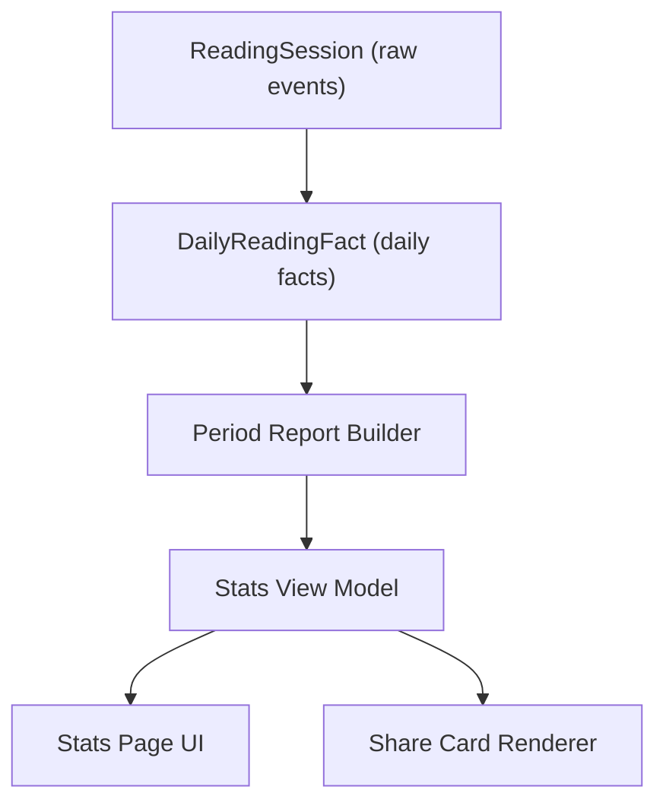

# Reading Stats Architecture And Schema

## 目标

ReadAny 的统计系统要从“简单卡片 + 热力图”升级成真正的报告系统。

升级后的系统需要满足：

- 同时支持 `日 / 周 / 月 / 年 / 总`
- 前四个维度都支持周期切换
- `总` 维度强调长期陪伴感
- 每个维度都可生成分享图
- 桌面端与移动端共用同一套统计底座
- UI 不直接操作 session 原始数据

## 现状问题

当前实现主要卡在模型太扁：

- [packages/core/src/stats/reading-stats.ts](/Users/tuntuntutu/Project/ReadAny/packages/core/src/stats/reading-stats.ts) 只有 `DailyStats`、`OverallStats`、`TrendPoint`
- [packages/app/src/components/stats/ReadingStatsPanel.tsx](/Users/tuntuntutu/Project/ReadAny/packages/app/src/components/stats/ReadingStatsPanel.tsx) 同时承担数据请求、周期切换、图表映射和展示
- [packages/core/src/stores/reading-session-store.ts](/Users/tuntuntutu/Project/ReadAny/packages/core/src/stores/reading-session-store.ts) 的 `stats` 仍是“单书统计”，与全局统计并不是同一套模型

这会导致：

- 任何新维度都需要临时拼数据
- UI 和统计逻辑耦合过紧
- 分享图没有统一输入
- 后面做移动端时容易重复造轮子

## 建议分层

统计系统拆成五层：



### 1. 原始事件层

唯一事实来源仍然是 `ReadingSession`。

责任：

- 保存每次阅读会话
- 提供原始时间、书籍、页数等数据

建议保留字段：

- `id`
- `bookId`
- `startedAt`
- `endedAt`
- `totalActiveTime`
- `pagesRead`
- `state`

未来可选增强字段：

- `progressDelta`
- `locationStart`
- `locationEnd`
- `deviceType`
- `source`

现阶段不建议直接扩表，先把聚合结构定下来。

### 2. 日事实层

这是整个统计系统的底座。所有周/月/年/总都从这里汇总，不再每种维度单独查 session。

核心类型建议：

```ts
export interface DailyReadingFact {
  date: string; // local YYYY-MM-DD
  weekKey: string; // e.g. 2026-W16
  monthKey: string; // e.g. 2026-04
  yearKey: string; // e.g. 2026

  totalTime: number; // minutes
  pagesRead: number;
  sessionsCount: number;
  booksTouched: number;
  completedBooks: number;

  avgSessionTime: number;
  longestSessionTime: number;
  firstSessionAt?: number;
  lastSessionAt?: number;
  peakHour?: number; // 0-23

  bookBreakdown: DailyBookBreakdown[];
}

export interface DailyBookBreakdown {
  bookId: string;
  title: string;
  author?: string;
  coverUrl?: string;
  totalTime: number;
  pagesRead: number;
  sessionsCount: number;
  progressStart?: number;
  progressEnd?: number;
  progressDelta?: number;
}
```

### 3. 周期报告层

日事实层上面做标准化报告，不让页面各自算。

```ts
export type StatsDimension = "day" | "week" | "month" | "year" | "lifetime";

export interface StatsPeriodRef {
  dimension: StatsDimension;
  key: string;
  startAt: string; // local date
  endAt: string; // local date
  label: string;
}

export interface StatsNavigation {
  canGoPrev: boolean;
  canGoNext: boolean;
  prevKey?: string;
  nextKey?: string;
}

export interface BaseStatsReport {
  dimension: StatsDimension;
  period: StatsPeriodRef;
  navigation: StatsNavigation;
  summary: StatsSummary;
  insights: StatsInsight[];
  charts: StatsChartBlock[];
  topBooks: TopBookEntry[];
  shareCard: StatsShareCardModel;
}
```

这里的关键是：

- 每个报告都有统一的 `summary`
- 也都有 `charts / insights / topBooks / shareCard`
- 但不同维度可以额外扩展自己的 `details`

### 4. 展示模型层

UI 不直接读 `summary.totalReadingTime` 这类底层字段，而是读可展示模块：

```ts
export interface StatsViewModel {
  header: {
    title: string;
    subtitle?: string;
    periodLabel: string;
  };
  heroMetrics: StatsMetricCard[];
  sections: StatsSectionBlock[];
  shareCard: StatsShareCardModel;
}
```

这么做的好处：

- 桌面端和移动端可以不同排版
- 但都从同一个 `ViewModel` 出发
- 分享图也可以直接复用其中一部分信息

### 5. 分享渲染层

分享图不应该截图页面，而应该使用标准输入直接生成图片。

```ts
export interface StatsShareCardModel {
  dimension: StatsDimension;
  title: string;
  subtitle?: string;
  periodLabel: string;
  accentMetric: StatsMetricCard;
  secondaryMetrics: StatsMetricCard[];
  chart?: StatsChartBlock;
  topBook?: TopBookEntry;
  footer: string;
  theme: "light" | "dark" | "brand";
}
```

## 统一字段口径

统计要先统一口径，否则后面报表会互相打架。

### 时间口径

- 所有分桶按本地时区算，不按 UTC 算
- `date` 必须是本地日键
- 当前 [packages/core/src/stats/reading-stats.ts](/Users/tuntuntutu/Project/ReadAny/packages/core/src/stats/reading-stats.ts) 里的 `toISOString().split("T")[0]` 以后要替换

### 阅读时长口径

- UI 展示以分钟为基础
- 底层保留毫秒也可以，但报告层统一转分钟

### 书籍口径

- `booksTouched`: 当前周期读过的书
- `completedBooks`: 当前周期内完成的书
- `lifetimeBooks`: 生涯中阅读过的书

### streak 口径

- `currentStreak`: 截止今天仍在持续的连续阅读天数
- `longestStreak`: 历史最长连续阅读天数
- 周/月/年报告还可以有“本周期内 streak 峰值”

## 建议的基础模块

无论哪个维度，报告对象里都优先复用这些模块：

- `summary`
- `activityTimeline`
- `distribution`
- `topBooks`
- `habitInsights`
- `milestones`
- `comparison`

但各维度不会全部同时出现。

## 总览维度的特殊字段

`lifetime` 需要一组长期陪伴字段：

```ts
export interface LifetimeContext {
  joinedSince: string;
  daysSinceJoined: number;
  firstReadingDate?: string;
  totalActiveDays: number;
  totalInactiveDays: number;
  companionMessage: string;
}
```

这里的 `joinedSince` 推荐口径：

1. 账号创建时间
2. 本地首次使用时间
3. 第一条阅读记录时间

当前如果没有 1 和 2，就先降级为 3。
